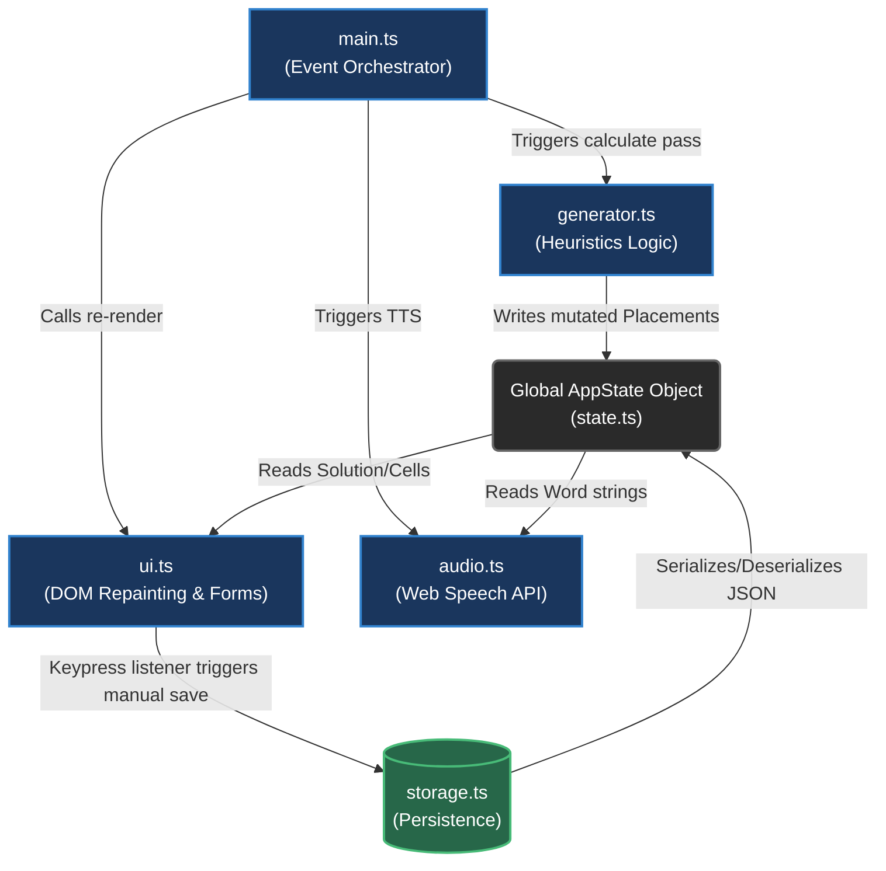
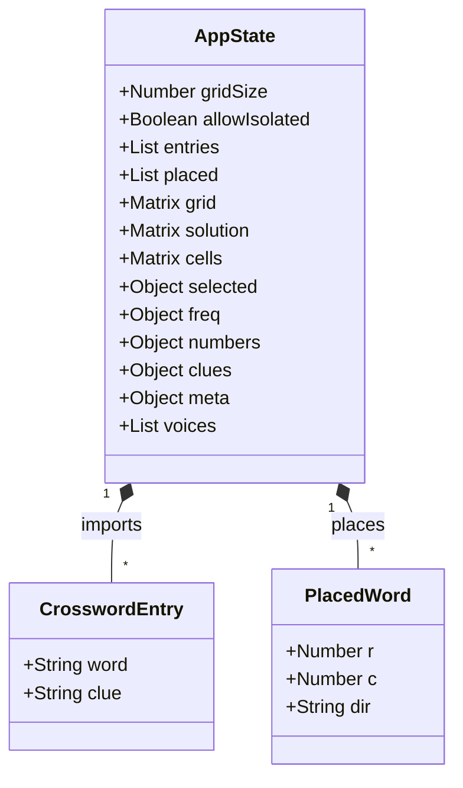
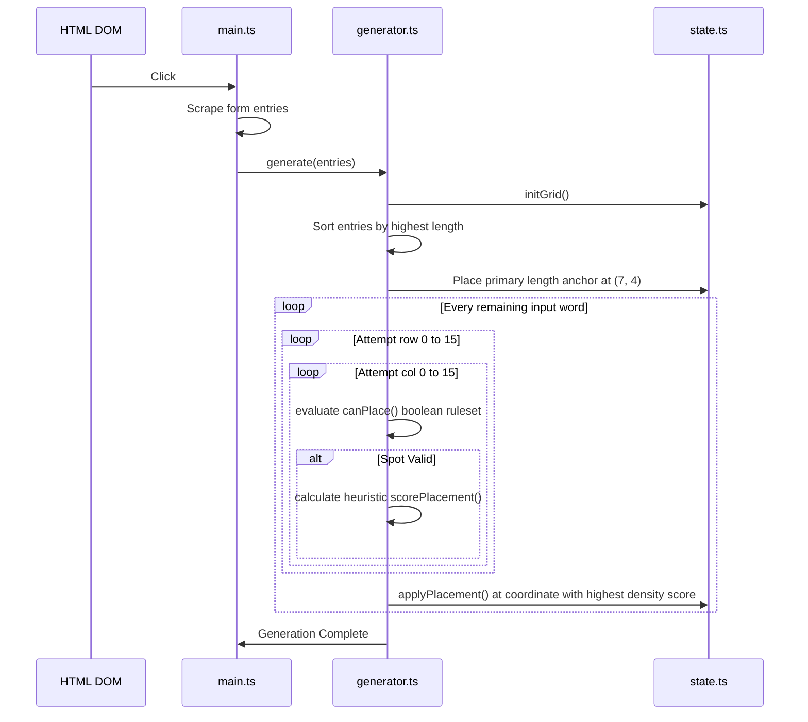
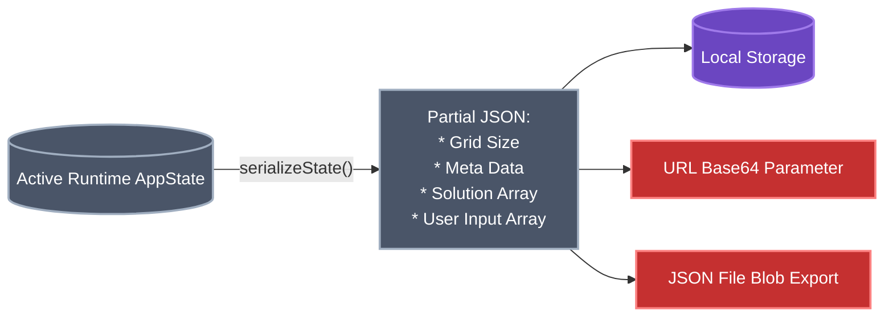

# System Architecture Design Document

**Project:** German Learning Crossword Application
**Version:** 1.0.0

## 1. Executive Summary

The German Learning Crossword Trainer is a client-side application that generates crossword puzzles from intersecting vocabulary words. It is built using TypeScript and Vite.

## 2. Distributed Module Flow

The application handles DOM manipulation directly via a centralized runtime state container (`state.ts`).

## 3. The `AppState` Container

The application utilizes strict TypeScript interfaces for state management. State prevents `any` references.

## 4. Generator Algorithm

The generator logic resides in `generator.ts`.
This service determines overlapping X,Y coordinates for the vocabulary words using a backtracking algorithm.

### Algorithmic Pipeline

1. **Initialize State**: The `AppState` matrix is cleared to `null`.
2. **Frequency Map Generation**: `initCharFreq()` calculates a density map of letters.
3. **Primary Anchor Setting**: The longest word is placed in the center of the grid horizontally.
4. **Iteration**:
    * Unplaced words are evaluated against potential start coordinates.
    * `canPlace()` checks array bounds and character collisions.
    * Valid spots are ranked via `scorePlacement()`.

## 5. Storage and Export Serialization

The application runs entirely client-side. Data serialization facilitates URL sharing and `localStorage` saving.

### Persistence Triggers

The state is persisted to `localStorage` via `saveState()` on the following actions:

* Physical keystrokes in `ui.ts` grid inputs.
* Virtual keyboard keystrokes via `renderKeyboard()`.
* Execution of `generate()`.
